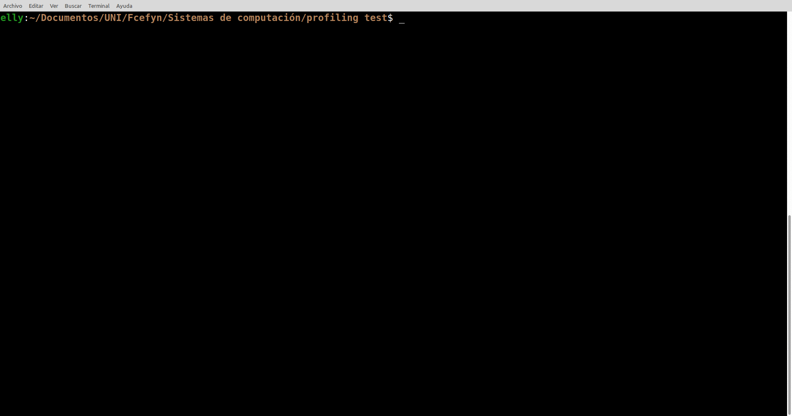
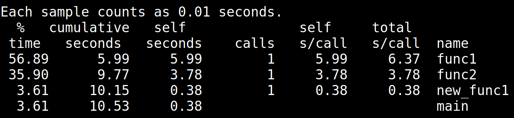
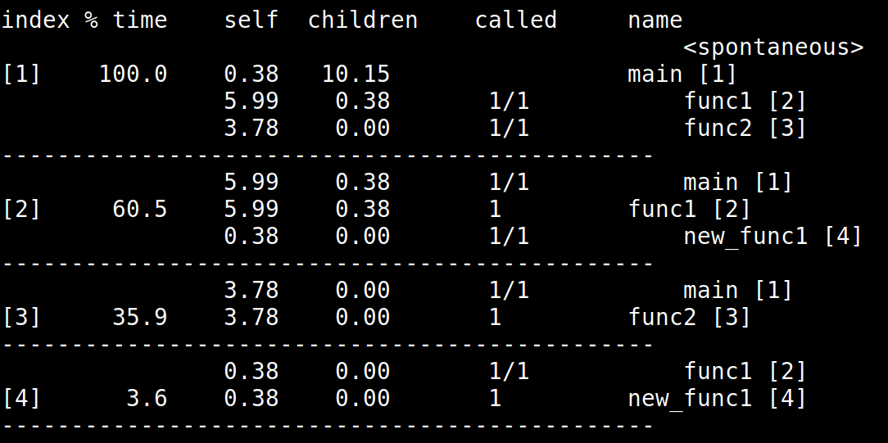

# **Primera Parte**

Una prueba de rendimiento (en inglés benchmark) es una técnica utilizada para medir el rendimiento de un sistema o uno de sus componentes.​ Más formalmente puede entenderse que una prueba de rendimiento es el resultado de la ejecución de un programa informático o un conjunto de programas en una máquina, con el objetivo de estimar el rendimiento de un elemento concreto, y poder comparar los resultados con máquinas similares. En el ámbito de las computadoras, una prueba de rendimiento podría ser realizada en cualquiera de sus componentes, ya sea la CPU, RAM, tarjeta gráfica, etc. También puede estar dirigida específicamente a una función dentro de un componente, como la unidad de coma flotante de la CPU, o incluso a otros programas. Los benchmarks devuelven información detallada de todas las características que posee y con base en dicha información, se puede evaluar si esta completamente optimizado para correr o ejecutar las aplicaciones que necesitamos dependiendo del área. 

Los benchmark que consideramos mas importantes en nuestro caso son:

| Tareas | Benchmark mas representativo |
|-----------|-----------|
| Todo lo relacionado al gaming   | 3DMark   |
| Navegación web y multi-tareas   | PCMark 10   |
| Optimización de Software         | Build Linux Kernel | 

**3DMark** es el benchmark mas elegido para medir el rendimiento gráfico en juegos. Simula cargas reales como renderizado 3D, iluminación y física, evaluando tanto la GPU como la CPU en escenarios típicos de gaming.

**PCMark 10** mide el rendimiento en tareas diarias como navegación web (carga de páginas, JavaScript), productividad (oficina) y multitarea, simulando un uso real del equipo.

**Build Linux Kernel** mide el tiempo de compilación del kernel de Linux, una tarea intensiva en CPU ideal para evaluar eficiencia en desarrollo, compilación y optimización de software, especialmente en uso de múltiples núcleos.

## Time Profiling

Vamos a realizar una prueba con **gprof**, un perfilador clásico que utiliza la técnica de inyección de código. Al compilar el programa con banderas específicas, gprof inserta código adicional para medir el tiempo de ejecución de las funciones. Luego, al ejecutarlo, genera un archivo de datos que se analiza para producir un informe detallado sobre el tiempo de CPU consumido por cada parte del programa. Con esta herramienta vamos a poder validar experimentalmente la eficiencia de nuestro código y detectar áreas de mejora.

### Paso 1 - Crear programa para pruebas

Para esta prueba utilizaremos los siguientes archivos de código en C.


```C
//test_gprof.c
#include<stdio.h>

void new_func1(void);

void func1(void)
{
    printf("\n Inside func1 \n");
    int i = 0;

    for(;i<0xffffffff;i++);
    new_func1();

    return;
}

static void func2(void)
{
    printf("\n Inside func2 \n");
    int i = 0;

    for(;i<0xafffffff;i++);
    return;
}

int main(void)
{
    printf("\n Inside main()\n");
    int i = 0;

    for(;i<0xfffff11;i++);
    func1();
    func2();

    return 0;
}
```

```C
//test_gprof_new.c
#include<stdio.h>

void new_func1(void)
{
    printf("\n Inside new_func1()\n");
    int i = 0;

    for(;i<0xfffff66;i++);

    return;
}

```

Claramente este código solo es un ejemplo que busca generar tareas arbitrarias (for loops) para mantener la CPU ocupada artificialmente.

### Paso 2 - Compilar con opción de profiling

Para realizar las pruebas con gprof debemos compilar el código usando gcc con la función -pg que generá código extra para guardar información de profiling en un formato que gprof puede utilizar. Así la compilación se hará como:

```
gcc -pg test_gprof.c test_grpf_new.c -o test_gprof
```

Una vez compilado el programa lo ejecutamos. Notaremos que la finalizar la ejecución aparecerá un nuevo archivo gmon.out en el directorio, este archivo contiene la información necesaria para gprof.



### Paso 3 - Obtener resultados

Para poder ver los resultados del archivo gmon.out ejecutamos el comando gprof indicando como parámetros el ejecutable del código que compilamos y el archivo gmon.out.

```
gprof test_gprof gmon.out
```

Adicionalmente podemos redirigir la salida a un archivo txt.

```
gprof test_gprof gmon.out > analysis.txt
```

En este caso de ejemplo con un procesador *Intel(R) Core(TM) i7-8750H CPU @ 2.20GHz* el resultado fue el siguiente:



Los elementos de la tabla son:

- **% time**: El porcentaje del tiempo total de ejecución que el programa uso en esa función.
- **cumulative seconds**: La suma del tiempo de ejecución de la función y las funciones que se encuentran por encima de esta.
- **self seconds**: Tiempo en segundos que se estuvo ejecutando la función.
- **calls**: Número de veces que la función fue llamada.
- **self s/ call**: Promedio de segundos gastados en esta función por llamada (Dado que todas las funciones se llamaron 1 sola vez esto es igual a self seconds).
- **total s/ call**: Promedio en segundos gastados en esta función y sus decendientes (Nótese que para func1 esto es el tiempo en func1 más en tiempo en new_func1).

Además de esta table gprof también nos provee una segunda tabla con datos similares donde podemos ver el tiempo gastado en cada función, sus funciones "hijas".



Donde **self** es el tiempo gastado en la función en sí, **children** el tiempo total acumulado en sus funciones hijas y **called** en número de veces que la función padre llamo a la hija/el total de veces que la función hija fue llamada.

## Rendimiento de procesadores de ejemplo

Cual es el rendimiento de estos procesadores para compilar el kernel de linux?

- Intel Core i5-13600K
- AMD Ryzen 9 5900X 12-Core

Cual es la aceleración cuando usamos un AMD Ryzen 9 7950X 16-Core