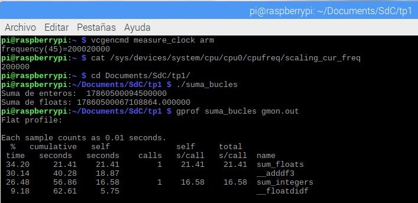

# Segunda Parte

## Variacion de frecuencia en un procesador

El rendimiento de un procesador es el resultado de cómo se combinan y equilibran estos parámetros: la velocidad de operación (fCPU y TCPU), la eficiencia en la ejecución de instrucciones (CPI), la optimización del código (número de instrucciones) y la capacidad de manejar múltiples tareas (multitarea).

Para esta practica, vamos a utilizar una **Raspberry pi 3 b** y vamos a crear un codigo que demore aproximadamente 10s en ejecutarse. Luego de esto bajaremos la frecuencia y mediremos los tiempos de ejecución del mismo programa.

### Paso 1 - Crear programa para pruebas

Para esta prueba utilizaremos el siguiente archivo de código en C.

Trabajamos con una frecuencia base de 600MHz en el procesador en el cual a partir de diseñar el codigo que tenga un tiempo de ejecución de 10s, fuimos bajando la frecuencia para ver como cambiaba el tiempo de ejecución.

```C
#include <stdio.h>

#define ITERATIONS 189000000        //Valor obtenido mediante la practica
long long sum_integers();
double sum_floats();

long long sum_integers(){
    long long sum_int=0;
    for (long long i=1 ; i<= ITERATIONS ; i++){
        sum_int +=i;
    }
    return sum_int;
}

double sum_floats(){
    double sum_floats = 0.0;
    for (long long i=1; i<=ITERATIONS; i++){
        sum_floats += (double)i;
    }
    return sum_floats;
}

int main(){
    long long result_int= sum_integers();
    double result_float = sum_floats();

    printf("Suma de enteros: %lld\n", result_int);
    printf("Suma de floats: %f\n", result_float);
    return 0;
}
``` 

Claramente este código solo es un ejemplo que busca generar tareas arbitrarias (for loops) para mantener la CPU ocupada artificialmente.

### Paso 2 - Ejecutar el codigo

De la misma manera que se realizó en la **Primera Parte**, para realizar las pruebas con gprof debemos compilar el código usando gcc con la función -pg que generá código extra para guardar información de profiling en un formato que gprof puede utilizar.

### Paso 3 - Obtener resultados

A continuación se presentan los resultados obtenidos para las diferentes frecuencias:

**Cpu con frecuencia de 600MHz**


**Cpu con frecuencia de 500MHz**


**Cpu con frecuencia de 400MHz**


**Cpu con frecuencia de 300MHz**


**Cpu con frecuencia de 200MHz**




Para una mejor visualización vamos a representar el tiempo total de ejecucion con cada frecuencia en una tabla:

| Frecuencia de CPU (MHz)| Tiempo de ejecucion (s) |
|-----------|-------------|
| 600   | 9.47   |
| 500   | 25.07  |
| 400   | 32.46 | 
| 300   | 42.76   |
| 200   | 61.61   |

A partir del cual podemos crear la siguiente grafica: 


Donde podemos ver que su comportamiento tiene una tendencia a ser lineal, inversamente proporcional al valor de la frecuencia. 

Ademas de los tiempos de ejecución de cada una de las funciones, podemos ver que existen otras 2 que son: **__adddf3** y **__floatdidf**. Estas dos funciones surgen del proceso de compilacion o de runtime que controlan a los datos de tipo flotante.

Como conclusión podemos decir que estamos verificando que el tiempo de ejecución se comporta de manera inversamente lineal al valor de la frecuencia. 